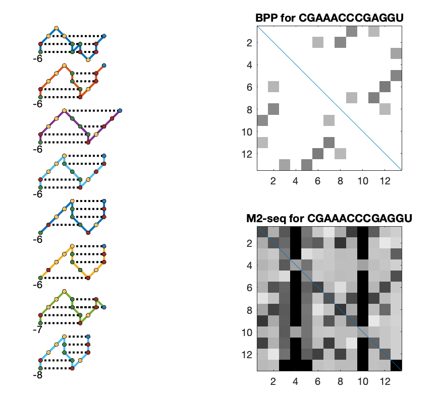
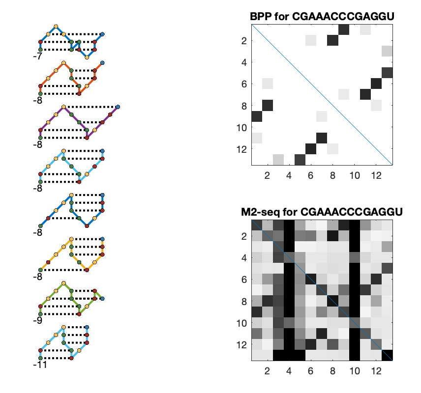
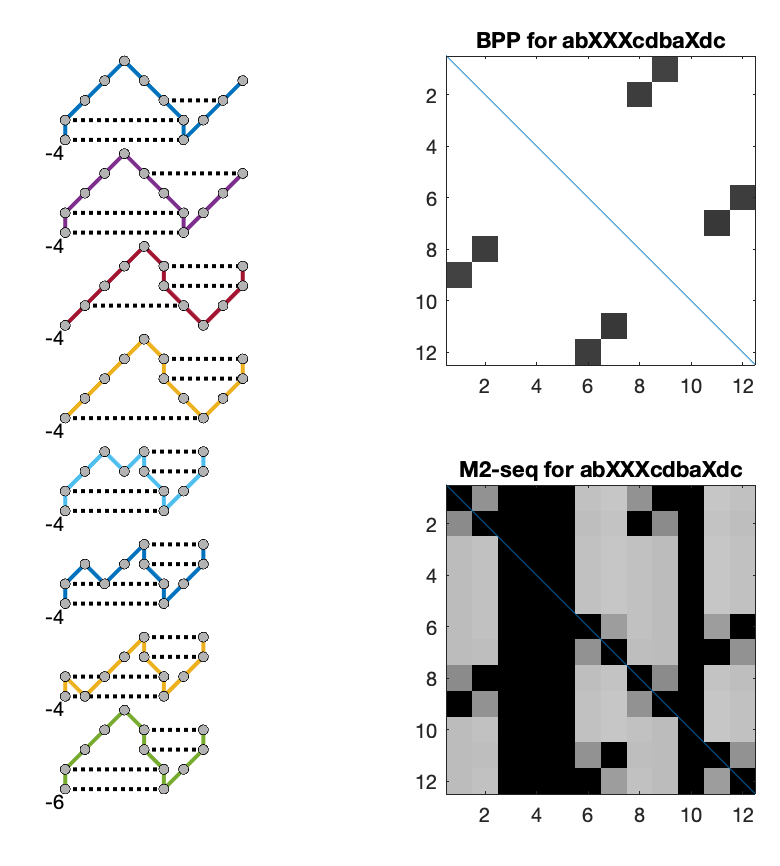
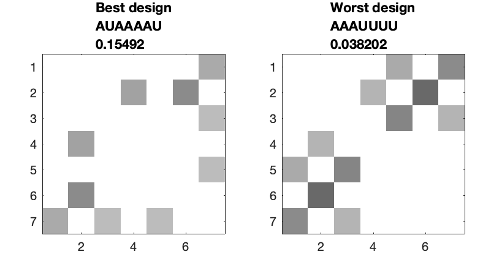

# Toyfold 1D
Testing calculations for simple Toyfold RNA folding model in 1D

(C) R. Das, Stanford University 2020, 2021

## Features
* Brute-force enumeration of bead-based model for RNA folding
* Simple script to display RNA conformations
* Scoring of conformations based on Toyfold model -- pair energy, freezing upon forming helix, penalty for bending RNA
* Exact calculation of partition function and base pair probabilities, including pseudoknots.
* Exact calculation of mutate-and-map-seq 'data'
* Enumerative design of sequences that fold into target structures 
* Benchmarks for neural network architectures with unambiguous ground truth -- check out [benchmarks](benchmarks), specifically [README_benchmark.md](benchmarks/README_benchmark.md)

**Note**: This repo was written in MATLAB for semi-historical reasons; Das lab is moving to a numpy/scipy port in the [pyFold-1D](https://github.com/DasLab/pyFold-1D) repo!

## Getting started
* Add to your MATLAB path the directory `scripts/` and all subdirectories 
* To see enumeration over all states of a sequence designed to fold into a pseudoknot, try
```
analyze_sequence('CGAAACCCGAGGU');
```
You should get something like:


* Above assumes a model with base pair energy of -2 kT and bending penalty of +1 kT

```
params = get_default_energy_parameters()
```
should give 
params = 
```
  struct with fields:

    epsilon: -2
      delta: 1
```
* If we strengthen base pairs and penalize bending more, we get a more well-defined structure:

```
params = get_default_energy_parameters();
params.epsilon = -3;
params.delta = 2;
analyze_sequence('CGAAACCCGAGGU',params);
```




* For some other fun examples, try a sequence that does not fold as cleanly into a pseudoknot:
``` 
analyze_sequence('CCAAAGGGGACC');
```


 Or one that takes advantage of 'lowercase' perfect matches to get the best possible pseudoknot:
``` 
analyze_sequence('abXXXcdbaXdc');
```


 
* Some functionality is set up to enumerate over all sequences that are compatible with a target secondary structure, i.e., design. Give it a shot with a hairpin:

```
enumerative_design( '((...))' )
```


The number in the title is p(target), probability of seeing the target secondary structure in the ensemble,

* Note that, without loss of generality the first base is set to an A, rest can be A,C,G, or U. You can also force a particular design pattern with codes A, C, G, U, N (any), R(purine), Y(pyrimidine), W (weak=A,U), S (strong=G,C). (In actuality the current energy model has the same base pairing strength epsilon=-2 for A-U and G-C, so strong vs. weak doesn't matter.) 

```
enumerative_design( '((...))','AWWWWWW' )
```



Note that its harder to find a good design here due to lots of misfolds. Also, interestingly, although the best design is ranked by p(target) its dot plot looks 'messier' than the worst design. An interesting next step might be to rank by ensemble defect or similar.

* And you can design over pseudoknots too! Though the calculation becomes unwieldy for long sequences...

```
enumerative_design( '((..[)).]' )
```


* For more examples of using scripts, you can check out the unit tests. In MATLAB, go into `scripts/unittests` and type `runtests`.

## Notes
* The Toyfold model is developed through Notes available in a Google Team Drive -- contact Rhiju for notes. 
* The 'pencil-and-paper' variant of the model (modular helices, strong bending penalty) is being written up into a pedagogical paper by folks in the Das lab.
* This repo is meant to help test rules even in the limit of weak bending penalties where there can be a *lot* of conformations that are hard to track with pencil and paper.
* The key concept in this software is that the microstates of an RNA are defined by the positions of the nucleotides (x) and their pairings (p). A secondary structure is actually a macrostate composed of multiple microstates. It would probably make sense to combine this information into a single object (conformation). Chainbreak information is also inferred.
* The energy model has only two parameters at the moment, epsilon (the energy for forming a base pair) and delta (the energy for bending the chain). It would probably make sense to combine these parameters (and any others that may be added) to a single object (energy_model).
* I haven't added in an energy term for harmonic fluctuations (though this would be straightforward to compute via log det M, where M is a connectivity matrix).
* An early version of this repo, forked at [ToyFold-1D-Directed](https://github.com/rhiju/ToyFold-1D-Directed), explored forcing directions of the two chains going into each partner of a base pair to be exactly opposite. This makes nearest-neighbor decomposition work out cleanly, but produces non-intuitive constraints on possible structures. 


